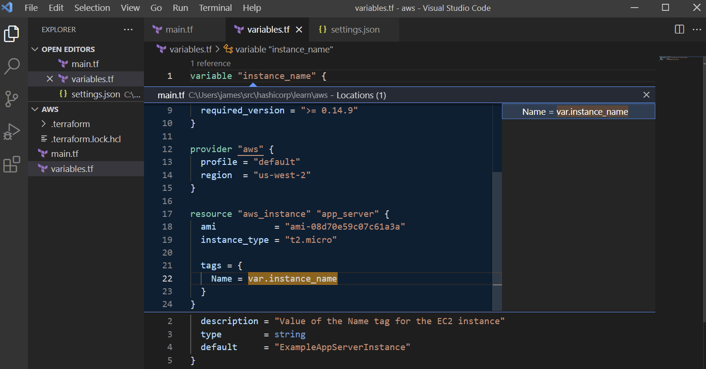

# OpenTofu Extension for Visual Studio Code

[OpenTofu Extension for Visual Studio Code (VS Code)](https://marketplace.visualstudio.com/items?itemName=gamunu.opentofu) with the [Terraform Language Server](https://github.com/hashicorp/terraform-ls) adds editing features for [OpenTofu](https://opentofu.org/) files such as syntax highlighting, IntelliSense, code navigation, code formatting, module explorer and much more!

## Quick Start

Get started writing OpenTofu configurations with VS Code in three steps:

- **Step 1:** If you haven't done so already, install [OpenTofu](https://opentofu.org/docs/intro/install/)

- **Step 2:** Install the [OpenTofu Extension for VS Code](https://marketplace.visualstudio.com/items?itemName=gamunu.opentofu).

- **Step 3:** To activate the extension, open any folder or VS Code workspace containing OpenTofu files. Once activated, the OpenTofu language indicator will appear in the bottom right corner of the window.

New to OpenTofu? Read the [OpenTofu Introduction](https://opentofu.org/docs/intro/)

See [Usage](#usage) for more detailed getting started information.

Read the [Troubleshooting Guide](#troubleshooting) for answers to common questions.

## Features

- [IntelliSense](#intellisense-and-autocomplete) Edit your code with auto-completion of providers, resource names, data sources, attributes and more
- [Syntax validation](#syntax-validation) Provides inline diagnostics for invalid configuration as you type
- [Syntax highlighting](#syntax-highlighting) Highlighting syntax from OpenTofu 1.X
- [Code Navigation](#code-navigation) Navigate through your codebase with Go to Definition and Symbol support
- [Code Formatting](#code-formatting) Format your code with `tofu fmt` automatically
- [Code Snippets](#code-snippets) Shortcuts for common snippets like `for_each` and `variable`
- [OpenTofu Module Explorer](#opentofu-module-and-provider-explorer) View all modules and providers referenced in the currently open document.
- [OpenTofu commands](#opentofu-commands) Directly execute commands like `tofu init` or `tofu plan` from the VS Code Command Palette.

### IntelliSense and Autocomplete

IntelliSense is a general term for a variety of code editing features including: code completion, parameter info, quick info, and member lists. IntelliSense features are sometimes called by other names such as autocomplete, code completion, and code hinting.

For OpenTofu constructs like resource and data, labels, blocks and attributes are auto completed both at the root of the document and inside other blocks. This also works for OpenTofu modules that are installed in the workspace, attributes and other constructs are autocompleted.

> **Note:** If there are syntax errors present in the document upon opening, intellisense may not provide all completions. Please fix the errors and reload the document and intellisense will return. See [hcl-lang#57](https://github.com/hashicorp/hcl-lang/issues/57) for more information.

Invoking intellisense is performed through the [keyboard combination](https://code.visualstudio.com/docs/getstarted/keybindings) for your platform and the results depend on where the cursor is placed.

If the cursor is at the beginning of a line and no other characters are present, then a list of constructs like `data`, `provider`, `resource`, etc are shown.


If inside a set of quotes or inside a block, the extension provides context specific completions appropriate for the location. For example, inside a `resource` block attributes for a given provider are listed.


Combining `editor.suggest.preview` with the [pre-fill required fields](#code-completion) setting will provide inline snippet suggestions for blocks of code:


Completing the snippet allows you to tab complete through each attribute and block.

### Syntax Validation

OpenTofu configuration files are validated when opened and on change, and invalid code is marked with diagnostics.

HCL syntax is checked for e.g. missing control characters like `}`, `"` or others in the wrong place.


Enhanced validation of selected OpenTofu language constructs in both `*.tf` and `*.tfvars` files based on detected OpenTofu version and provider versions is also provided. This can highlight deprecations, missing required attributes or blocks, references to undeclared variables and more, [as documented](https://github.com/hashicorp/terraform-ls/blob/main/docs/validation.md#enhanced-validation).


The enhanced validation feature is enabled by default but can be disabled using the following setting:

```json
"opentofu.validation.enableEnhancedValidation": false
```

The extension also provides validation through [`tofu validate`](https://opentofu.org/docs/cli/commands/validate/). This can be triggered via command palette. Unlike the other validation methods, this one requires the OpenTofu CLI installed and a previous successful run of `tofu init` (i.e. local installation of all providers and modules) to function correctly. It is the slowest method, but the most thorough - i.e. it will catch the most mistakes.


### Syntax Highlighting

OpenTofu syntax highlighting recognizes language constructs of OpenTofu version 1.X. OpenTofu providers, modules, variables and other high-level constructs are recognized, as well as more complex code statements like `for` loops, conditional expressions, and other complex expressions.


### Code Navigation

While editing, you can right-click different identifiers to take advantage of several convenient commands

- `Go to Definition` (`F12`) navigates to the code that defines the construct where your cursor is. This command is helpful when you're working with OpenTofu modules and variables defined in other files than the currently opened document.
- `Peek Definition` (`Alt+F12`) displays the relevant code snippet for the construct where your cursor is directly in the current editor instead of navigating to another file.
- `Go to Declaration` navigates to the place where the variable or other construct is declared.
- `Peek Declaration` displays the declaration directly inside the current editor.

### Code Formatting

This extension utilizes [`tofu fmt`](https://opentofu.org/docs/cli/commands/fmt/) to rewrite an open document to a canonical format and style. This command applies a subset of the [OpenTofu language style conventions](https://opentofu.org/docs/language/syntax/style/), along with other minor adjustments for readability.

See the [Formatting](#formatting) Configuration section for information on how to configure this feature.

### Code Snippets

The extension provides several snippets to accelerate adding OpenTofu code to your configuration files:

- `fore` - For Each
- `module` - Module
- `output` - Output
- `provisioner` - Provisioner
- `vare` - Empty variable
- `varm` - Map Variable

### OpenTofu Module and Provider Explorer

List OpenTofu modules used in the current open document in the Explorer Pane, or drag to the Side Bar pane for an expanded view.

Each item shows an icon indicating where the module comes from (local filesystem, git repository, or OpenTofu Registry).


If the module comes from the OpenTofu Registry, a link to open the documentation in a browser is provided.


List OpenTofu providers used in the current open document in the Explorer Pane, or drag to the Side Bar pane for an expanded view.


### OpenTofu Commands

The extension provides access to several OpenTofu commands through the Command Palette:

- OpenTofu: init
- OpenTofu: init current folder
- OpenTofu: validate
- OpenTofu: plan

## Requirements

The OpenTofu VS Code extension bundles the [Terraform Language Server](https://github.com/hashicorp/terraform-ls) and is a self-contained install.

The extension does require the following to be installed before use:

- VS Code v1.86 or greater
- OpenTofu v1.0 or greater

## Platform Support

The extension should work anywhere VS Code itself and OpenTofu 1.0 or higher is supported. Our test matrix includes the following:

- Windows Server 2022 with OpenTofu v1.0
- macOS 12 with OpenTofu v1.0
- macOS 11 with OpenTofu v1.0
- Ubuntu 22.04 with OpenTofu v1.0

Intellisense, error checking and other language features are supported for OpenTofu v1.0 and greater.

Syntax highlighting targets OpenTofu v1.0 and greater.

## Usage

### VS Code Workspace support

It is a common pattern to have separate folders containing related OpenTofu configuration that are not contained under one root folder. For example, you have a main OpenTofu folder containing the configuration for a single application and several module folders containing encapsulated code for configuring different parts of component pieces. You could open each folder in a separate VS Code window, and bounce between each window to author your changes.

A better approach is to use [VS Code Workspaces](https://code.visualstudio.com/docs/editor/workspaces). Using our example above, open the main OpenTofu folder first, then use Add Folder to workspace to add the dependent module folders. A single VS Code window is used and all OpenTofu files are available to author your changes. This uses a single terraform-ls process that has an understanding of your entire project, allowing you to use features like `Go to Symbol` and `Reference counts` across your project.

### Single file support

Opening a single OpenTofu configuration file inside VS Code is currently not supported. We see this approach most commonly attempted by users of terminal editors like vim, where it is common to edit a single file at a time.

The OpenTofu VS Code extension works best when it has the full context of a OpenTofu project where it can parse the referenced files and provide the expected advanced language features.

The recommended workflow is to instead open the containing folder for the desired OpenTofu file inside a single VS Code editor window, then navigate to the desired file. This seems counter-intuitive when you only want to edit a single file, but this allows the extension to understand the OpenTofu setup you are using and provide accurate and helpful intellisense, error checking, and other language features.

### Refresh Intellisense

The extension will pick up new schema for OpenTofu providers you reference in your configuration files automatically whenever anything changes inside `.terraform`.

To provide the extension with an up-to-date schema for the OpenTofu providers used in your configuration:

1. Open any folder or VS Code workspace containing OpenTofu files.
1. Open the Command Palette and run `OpenTofu: init current folder` or perform a `tofu init` from the terminal.

### Remote Extension support

The Visual Studio Code [Remote - WSL extension](https://marketplace.visualstudio.com/items?itemName=ms-vscode-remote.remote-wsl) lets you use the Windows Subsystem for Linux (WSL) as your full-time development environment right from VS Code. You can author OpenTofu configuration files in a Linux-based environment, use Linux-specific toolchains and utilities from the comfort of Windows.

The Remote WSL extension runs the [OpenTofu Extension](https://marketplace.visualstudio.com/items?itemName=gamunu.opentofu) and other extensions directly in WSL so you can edit files located in WSL or the mounted Windows filesystem (for example /mnt/c) without worrying about pathing issues, binary compatibility, or other cross-OS challenges.

For a detailed walkthrough for how to get started using WSL and VS Code, see https://code.visualstudio.com/docs/remote/wsl-tutorial.

## Configuration

The extension does not require any initial configuration and should work out of the box. To take advantage of additional VS Code features or experimental extension features you can configure settings to customize behavior.

This extension offers several configuration options. To modify these open the [VS Code Settings Editor](https://code.visualstudio.com/docs/getstarted/settings#_settings-editor) in the UI or JSON view for [user and workspace level](https://code.visualstudio.com/docs/getstarted/settings#_creating-user-and-workspace-settings) settings, [scope your settings by language](https://code.visualstudio.com/docs/getstarted/settings#_languagespecific-editor-settings), or alternatively modify the `.vscode/settings.json` file in the root of your working directory.

### Code Completion

An experimental option can be enabled to prefill required fields when completing OpenTofu blocks with the following setting:

```json
"opentofu.experimentalFeatures.prefillRequiredFields": true
```

For example, choosing `aws_alb_listener` in the following block inserts a snippet in the current line with the `resource` block entirely filled out, containing tab stops to fill in the required values.


Combine this with `editor.suggest.preview` and the editor will provide inline snippet suggestions for blocks of code:


Completing the snippet allows you to tab complete through each attribute and block.

### Code Lens

Display reference counts above top level blocks and attributes

```json
"opentofu.codelens.referenceCount": true
```



> **Note:** This feature impacts extension performance when opening folders with many modules present. If you experience slowness or high CPU utilization, open a smaller set of folders or disable this setting.

### Formatting

To enable automatic formatting, it is recommended that the following be added to the extension settings for the OpenTofu extension:

```json
"[terraform]": {
  "editor.defaultFormatter": "gamunu.opentofu",
  "editor.formatOnSave": true,
  "editor.formatOnSaveMode": "file"
},
"[terraform-vars]": {
  "editor.defaultFormatter": "gamunu.opentofu",
  "editor.formatOnSave": true,
  "editor.formatOnSaveMode": "file"
}
```

> It is recommended to set `editor.defaultFormatter` to ensure that VS Code knows which extension to use to format your files. It is possible to have more than one extension installed which claim a capability to format OpenTofu files.

When using the `editor.formatOnSaveMode` setting, only `file` is currently supported. The `modifications` or `modificationsIfAvailable` settings [use the currently configured SCM](https://code.visualstudio.com/updates/v1_49#_only-format-modified-text) to detect file line ranges that have changed and send those ranges to the formatter. The `file` setting works because `tofu fmt` was originally designed for formatting an entire file, not ranges. If you don't have an SCM enabled for the files you are editing, `modifications` won't work at all. The `modificationsIfAvailable` setting will fall back to `file` if there is no SCM and will appear to work sometimes.

If you want to use `editor.codeActionsOnSave` with `editor.formatOnSave` to automatically format OpenTofu files, use the following configuration:

```json
"editor.formatOnSave": true,
"[terraform]": {
  "editor.defaultFormatter": "gamunu.opentofu",
  "editor.formatOnSave": false,
  "editor.codeActionsOnSave": {
    "source.formatAll.opentofu": true
  },
},
"[terraform-vars]": {
  "editor.defaultFormatter": "gamunu.opentofu",
  "editor.formatOnSave": false,
  "editor.codeActionsOnSave": {
    "source.formatAll.opentofu": true
  },
}
```

This will keep the global `editor.formatOnSave` for other languages you use, and configure the OpenTofu extension to only format during a `codeAction` sweep.

> **Note**: Ensure that the tofu binary is present in the environment `PATH` variable. If the tofu binary cannot be found, formatting will silently fail.

### Validation

An experimental validate-on-save option can be enabled with the following setting:

```json
"opentofu.experimentalFeatures.validateOnSave": true
```

This will create diagnostics for any elements that fail validation. You can also run `tofu validate` by issuing the `OpenTofu: validate` in the command palette.

### Multiple Workspaces

If you have multiple root modules in your workspace, you can configure the language server settings to identify them. Edit this through the VSCode Settings UI or add a `.vscode/settings.json` file using the following template:

```json
"opentofu.languageServer.rootModules": [
  "/module1",
  "/module2"
]
```

If you want to automatically search root modules in your workspace and exclude some folders, you can configure the language server settings to identify them.

```json
"opentofu.languageServer.excludeRootModules": [
  "/module3",
  "/module4"
]
```

If you want to automatically ignore certain directories when terraform-ls indexes files, add the folder names to this setting:

```json
 "opentofu.languageServer.ignoreDirectoryNames": [
   "folder1",
   "folder2"
 ]
```

### OpenTofu command options

You can configure the path to the tofu binary used by terraform-ls to perform operations inside the editor by configuring this setting:

```json
"opentofu.languageServer.path": "C:/some/folder/path"
```

You can override the opentofu execution timeout by configuring this setting:

```json
"opentofu.languageServer.timeout": "30"
```

You can set the path OpenTofu logs (`TF_LOG_PATH`) by configuring this setting:

```json
"opentofu.languageServer.logFilePath": "C:/some/folder/path/log-{{varname}}.log"
```

Supports variables (e.g. timestamp, pid, ppid) via Go template syntax `{{varname}}`

## Known Issues

- If there are syntax errors present in the document upon opening, intellisense may not provide all completions. Run `tofu: validate` and fix validation errors, then reload the document and intellisense will work again. Potential solutions for this are being investigated in See [hcl-lang#57](https://github.com/hashicorp/hcl-lang/issues/57) for more information.
- Completion inside incomplete blocks, such as `resource "here` (without the closing quote and braces) is not supported. You can complete the 1st level blocks though and that will automatically trigger subsequent completion for e.g. resource types. See [terraform-ls#57](https://github.com/hashicorp/terraform-ls/issues/57) for more information.
- A number of different folder configurations (specifically when your root module is not a parent to any submodules) are not yet supported. More information available in ([terraform-ls#32](https://github.com/hashicorp/terraform-ls/issues/32#issuecomment-649707345))

## Troubleshooting

- If you come across a problem with the extension, please file an [issue](https://github.com/gamunu/vscode-opentofu/issues/new/choose).
- If someone has already filed an issue that encompasses your feedback, please leave a 👍/👎 reaction on the issue
- Contributions are always welcome! Please see our [contributing guide](https://github.com/gamunu/vscode-opentofu/issues/new?assignees=&labels=enhancement&template=feature_request.md) for more details
- If you're interested in the development of the extension, you can read about our [development process](DEVELOPMENT.md)

### Generate a bug report

Experience a problem? You can have VS Code open a Github issue in our repo with all the information filled out for you. Open the Command Palette and invoke `OpenTofu: Generate Bug Report`. This will inspect the VS Code version, the OpenTofu extension version, the terraform-ls version and the list of installed extensions and open a browser window with GitHub loaded. You can then inspect the information provided, edit if desired, and submit the issue.

### Reload the extension

If you haven't seen the Problems Pane update in awhile, or hover and intellisense doesn't seem to showing up, you might not know what to do. Sometimes the OpenTofu extension can experience problems which cause the editor to not respond. The extension has a way of [reporting the problem](#generate-a-bug-report), but there is something you can do to get right back to working after reporting the problem: reload the OpenTofu extension.

You can reload the OpenTofu extension by opening the command palette and starting to type `Reload`. A list of commands will appear, select `Reload Window`. This will reload the Visual Studio Code window without closing down the entire editor, and without losing any work currently open in the editor.

### Pin to a specific version of the extension

If you wish to install a specific version of the extension, you can choose 'Install Another version' option in the Extensions pane. This will bring up a list of prior versions for the selected extension. Choose the version you want to install from the list.


## Contributing

We are an open source project on GitHub and would enjoy your contributions! Consult our [development guide](DEVELOPMENT.md) for steps on how to get started. Please [open a new issue](https://github.com/gamunu/terraform-vscode/issues) before working on a PR that requires significant effort. This will allow us to make sure the work is in line with the project's goals.

## Credits

- [Mikael Olenfalk](https://github.com/mauve) - creating the [vscode-terraform](https://github.com/mauve/vscode-terraform) extension, which was used as a starting point and inspiration for this extension.
- [Hashicorp Terraform](https://github.com/mauve) - creating the [vscode-terraform](https://github.com/hashicorp/vscode-terraform) extension, which was used as a starting point and inspiration for this extension.

# Trademarks

This project mentions the following registered trademarks:

- The names Terraform (registered trademark of HashiCorp) and OpenTofu (registered trademark of Linux Foundation) are used in this project for informational purposes only.
- This project does not claim any affiliation with or endorsement by the owners of the mentioned trademarks.