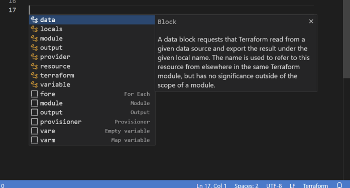
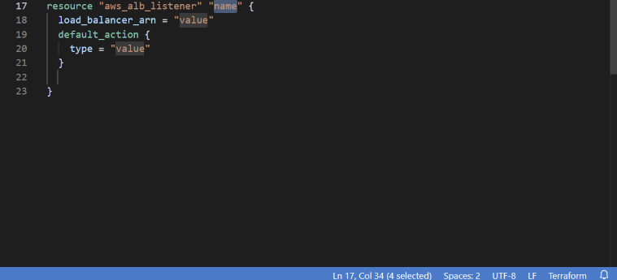

# Terraform Visual Studio Code Extension


The HashiCorp Terraform Visual Studio Code (VS Code) extension with the [Terraform Language Server](https://github.com/hashicorp/terraform-ls) adds editing features for <a href="https://www.terraform.io/">Terraform</a> files such as syntax highlighting, IntelliSense, code navigation, code formatting, module explorer and much more!

## Quick Start

1. Install [Terraform](https://www.terraform.io/downloads)
1. Install the extension [from the Marketplace](https://marketplace.visualstudio.com/items?itemName=HashiCorp.terraform)
1. Open your desired workspace and/or the root folder containing your Terraform files.

See [Getting Started](#getting-started) for more detailed information.

## Features

- [IntelliSense](#autocomplete-and-intellisense) Edit your code with auto-completion of providers, resource names, data sources, attributes and more
- [Syntax validation](#syntax-validation) Diagnostics using `terraform validate` provide inline error checking
- [Syntax highlighting](#syntax-highlighting) Highlighting syntax from Terraform 0.12 to 1.X
- [Code Navigation](#code-navigation) Navigate through your codebase with Go to Defintion and Symbol support
- [Code Formating](#code-formating) Format your code with `terraform fmt` automatically
- [Code Snippets](#code-snippets) Shortcuts for commmon snippets like fore_each and variable
- [Terraform Module Explorer](#terraform-module-explorer) View all modules and providers referenced in the currentyl open document.
- [Terraform commands](#terraform-commands) Directly execute commands like `terraform init` or `terraform plan` from the VS Code Command Palette.
- Manages installation and updates of the [Terraform Language Server (terraform-ls)](https://github.com/hashicorp/terraform-ls)

### IntelliSense and Autocomplete

IntelliSense is a general term for a variety of code editing features including: code completion, parameter info, quick info, and member lists. IntelliSense features are sometimes called by other names such as autcomplete, code completion, and code hinting.

> **Note:** If there are compile time errors present in the open document, intellisense will not provide completions. Please fix the errors and reload the document and intellisense will return. See [hcl-lang#57](https://github.com/hashicorp/hcl-lang/issues/57) for more information.

For Terraform constructs like resource and data, labels, blocks and attributes are auto completed both at the root of the document and inside other blocks. This also works for Terraform modules that are installed in the workspace, attributes and other constructs are autocompleted.

Invoking intellisense is performed through the keyboard combination for your platform (Ctrl+Space on Windows, control+space on Mac) and the results depend on where the cursor is placed.

If the cursor is a the begining of a line and no other characters are present, then a list of constructs like data, provider, resource, etc are shown.



If inside a set of quotes or inside a block, the extension provides context specific completions appropriate for the location. For example, inside a `resource` block attributes for a given provider are listed.


Combining `editor.suggest.preview` with [pre-fill required fields](#code-completion), the extension will provide inline snippet suggestions for blocks of code:


Completing the snippet allows you to tab complete through each attribute and block.

### Syntax validation

The extension provides validation through [`terraform validate`](https://www.terraform.io/cli/commands/validate). This verifies whether a configuration is syntactically valid and internally consistent, regardless of any provided variables or existing state. It is thus primarily useful for general verification of reusable modules, including correctness of attribute names and value types.

### Syntax highlighting

Terraform syntax highlighting reconizes language constructs from Terraform version 0.12 to 1.X. Terraform providers, modules, variables and other high-level constructs are reconized, as well as more complex code statements like `for` loops, condtional expressions, and other complex expressions.


Some language constructs will highlight differently for older versions of Terrafrom that are incompatible with newer ways of expressing Terraform code. In these cases we lean toward ensuring the latest version of Terraform displays correctly and do our best with older versions.

### Code Navigation

While editing, you can right-click different identifiers to take advantage of several convenient commands

- `Go to Definition` (`F12`) navigates to the code that defines the construct where your cursor is. This command is helpful when you're working with Terraform modules and variables defined in other files than the currently opened document.
- `Peek Definition` (`Alt+F12`) displays the relevant code snippet for the construct where your cursor is directly in the current editor instead of navigating to another file.
- `Go to Declaration` navigates to the place where the variable or other construct is declared.
- `Peek Declaration` displays the declaration directly inside the current editor.

### Code Formating

This extension utilizies [`terraform fmt`](https://www.terraform.io/cli/commands/fmt) to rewrite an open document to a canonical format and style. This command applies a subset of the [Terraform language style conventions](https://www.terraform.io/language/syntax/style), along with other minor adjustments for readability.


See the [Formating](#formatting) Configuration section for information on how to configure this feature.

### Code Snippets

The extension provides several snippets to accelerate adding Terraform code to your configuration files:

- `fore` - For Each
- `module` - Module
- `output` - Output
- `provisioner` - Provisioner
- `vare` - Empty variable
- `varm` - Map Variable

### Terraform Module Explorer

List Terraform modules used in the current open document in the Explorer Pane, or drag to the Side Bar pane for an expanded view.

Each item shows an icon indicating whether the module is a local module, a git module, or from the Terraform Registry. If the module comes from the Terraform Registry, a link to open the documentation in a browser is provided.

### Terraform Commands

The extension provides access to several Terraform commands through the Command Palette:

- Terraform: init
- Terraform: init current folder
- Terraform: validate
- Terraform: plan

## Getting Started

**IMPORTANT:** After installing, you must perform a `terraform init` to provide `terraform-ls` with an up-to-date provider schemas. The language server will not work correctly without first completing this step!

1. Install the extension [from the Marketplace](https://marketplace.visualstudio.com/items?itemName=HashiCorp.terraform)
1. Perform a `terraform init` to provide the extension with an up-to-date schema for the Terraform providers used in your configuration
1. Open your desired workspace and/or the root folder containing your Terraform files
1. Depending on your settings in VS Code, completion will start automatically (see the [Intellisense](#autocomplete-and-intellisense) section for more information)

## Configuration

This extension offers several configuration options. To modify these, navigate to the extension view within VS Code, select the settings cog and choose Extension settings, or alternatively, modify the `.vscode/settings.json` file in the root of your working directory.

### Code Completion

An experimental option can be enabled to prefill required fields when completing Terraform blocks with the following setting:

```json
"terraform-ls.experimentalFeatures": {
  "prefillRequiredFields": true
}
```



### Code Lens

Display reference counts above top level blocks and attributes

```json
"terraform.codelens.referenceCount": true
```


> **Note:** This feature impacts extension perfomance when opening folders with many modules present. If you experience slowness or high cpu utilization, open a smaller set of folders or disable this setting.

### Formatting

To enable automatic formatting, it is recommended that the following be added to the extension settings for the Terraform extension:

```json
"[terraform]": {
  "editor.defaultFormatter": "hashicorp.terraform",
  "editor.formatOnSave": true,
  "editor.formatOnSaveMode": "file"
}
"[terraform-vars]": {
  "editor.defaultFormatter": "hashicorp.terraform",
  "editor.formatOnSave": true,
  "editor.formatOnSaveMode": "file"
}
```

It is recommended to set `editor.defaultFormatter` to ensure that VS Code knows which extension to use to format your files. It is possible to have more than one extension installed which claim a capability to format Terraform files.

When using the `editor.formatOnSaveMode` setting, only `file` is currently supported. The `modifications` or `modificationsIfAvailable` settings [use the currently configured SCM](https://code.visualstudio.com/updates/v1_49#_only-format-modified-text) to detect file line ranges that have changed and send those ranges to the formatter. The `file` setting works because `terraform fmt` was originally designed for formatting an entire file, not ranges. If you don't have an SCM enabled for the files you are editing, `modifications` won't work at all. The `modificationsIfAvailable` setting will fall back to `file` if there is no SCM and will appear to work sometimes.

If you want to use `editor.codeActionsOnSave` with `editor.formatOnSave` to automatically format Terraform files, use the following configuration:

```json
"editor.formatOnSave": true,
"[terraform]": {
  "editor.defaultFormatter": "hashicorp.terraform",
  "editor.formatOnSave": false,
  "editor.codeActionsOnSave": {
    "source.formatAll.terraform": true
  },
},
"[terraform-vars]": {
  "editor.defaultFormatter": "hashicorp.terraform",
  "editor.formatOnSave": false,
  "editor.codeActionsOnSave": {
    "source.formatAll.terraform": true
  },
}
```

This will keep the global `editor.formatOnSave` for other languages you use, and configure the Terraform extension to only format during a `codeAction` sweep.

> **Note**: Ensure that the terraform binary is present in the environment `PATH` variable. If the terraform binary cannot be found, formatting will silently fail.

### Validation

An experimental validate-on-save option can be enabled with the following setting:

```json
"terraform-ls.experimentalFeatures": {
  "validateOnSave": true
}
```

This will create diagnostics for any elements that fail validation. You can also run `terraform validate` by issuing the `Terraform: validate` in the command palette.

### Multiple Workspaces

If you have multiple root modules in your workspace, you can configure the language server settings to identify them. Edit this through the VSCode Settings UI or add a `.vscode/settings.json` file using the following template:

```json
"terraform-ls.rootModules": [
  "/module1",
  "/module2"
]
```

If you want to automatically search root modules in your workspace and exclude some folders, you can configure the language server settings to identify them.

```json
"terraform-ls.excludeRootModules": [
  "/module3",
  "/module4"
]
```

If you want to automatically ignore certain directories when terraform-ls indexes files, add the folder names to this setting:

```json
 "terraform-ls.ignoreDirectoryNames": [
   "folder1",
   "folder2"
 ]
```

### Terraform command options

You can configure the path to the Terraform binary used by terraform-ls to perform operations inside the editor by configuring this setting:

```json
"terraform-ls.terraformExecPath": "C:/some/folder/path"
```

You can override the Terraform execution timeout by configuring this setting:

```json
"terraform-ls.terraformExecTimeout": "30"
```

You can set the path Terraform logs (TF_LOG_PATH) by configuring this setting:

```json
"terraform-ls.terraformLogFilePath": "C:/some/folder/path/log-{{.varName}}.log"
```

Supports variables (e.g. Timestamp, Pid, Ppid) via Go template syntax `{{.VarName}}`
        

### Telemetry

We use telemetry to send error reports to our team, so we can respond more effectively. You can configure VS Code to send all telemetry, just crash telemetry, just errors or turn it off entirely by [configuring](https://code.visualstudio.com/docs/getstarted/telemetry#_disable-telemetry-reporting) `"telemetry.telemetryLevel"` to your desired value. You can also [monitor what's being sent](https://code.visualstudio.com/docs/getstarted/telemetry#_output-channel-for-telemetry-events) in your logs.

## Known Issues

- If there are validation errors in the open document, intellisense does not provide inline completions. Run `Terraform: validate` and fix validation errors, then reload the document and intellisense will work again. This is being worked on in [terraform-vscode#123](https://github.com/hashicorp/terraform-vscode/issues/123).
- Completion inside incomplete blocks, such as `resource "here` (without the closing quote and braces) is not supported. You can complete the 1st level blocks though and that will automatically trigger subsequent completion for e.g. resource types. See [terraform-ls#57](https://github.com/hashicorp/terraform-ls/issues/57) for more information.
- A number of different folder configurations (specifically when your root module is not a parent to any submodules) are not yet supported. More information available in ([terraform-ls#32](https://github.com/hashicorp/terraform-ls/issues/32#issuecomment-649707345))

### Terraform 0.11 compatibility

If you are using a Terraform version prior to 0.12.0, you can install the pre-transfer 1.4.0 version of this extension by following the instructions in the [pin version section](#pin-to-a-specific-version-of-the-extension).

The configuration has changed from 1.4.0 to v2.X. If you are having issues with the Language Server starting, you can reset the configuration to the following:

```json
"terraform.languageServer": {
  "external": true,
  "args": ["serve"]
}
```

## Troubleshooting

- If you have a question about how to accomplish something with the extension, please ask on the [Terraform Editor Discuss site](https://discuss.hashicorp.com/c/terraform-core/terraform-editor-integrations/46)
- If you come across a problem with the extension, please file an [issue](https://github.com/hashicorp/vscode-terraform/issues/new/choose).
- If someone has already filed an issue that encompasses your feedback, please leave a 👍/👎 reaction on the issue
- Contributions are always welcome! Please see our [contributing guide](https://github.com/hashicorp/vscode-terraform/issues/new?assignees=&labels=enhancement&template=feature_request.md) for more details
- If you're interested in the development of the extension, you can read about our [development process](DEVELOPMENT.md)

### Generate a bug report

Experience a problem? You can have VS Code open a Github issue in our repo with all the information filled out for you. Open the Command Palette and invoke `Terraform: Generate Bug Report`. This will inspect the VS Code version, the Terrafform extension version, the terraform-ls version and the list of installed extensions and open a browser window with Github loaded. You can then inspect the information provided, edit if desired, and submit the issue.

### Reload the extension

If you haven't see the Problems Pane update in awhile, or hover and intellisense doesn't seem to showing up, you might not know what to do. Sometimes the Terraform extension can experience problems which cause the language server to crash or not respond. The extension has a way of logging the crash, but there is something you can do to get right back to working: reload the Terraform Language Server.

You can reload the Terraform Language Server by opening the command palette and starting to type Reload. A list of commands will appear, select Reload Window. This will reload the Visual Studio Code window without closing down the entire editor, and without losing any work currently open in the editor.

### Pin to a specific version of the extension

If you wish to install a specific version of the extension, you can choose 'Install Another version' option in the Extensions pane. This will bring up a list of prior versions for the selected extension. Choose the version you want to install from the list.


## Release History

**v2.0.0** is the first official release from HashiCorp, prior releases were by [Mikael Olenfalk](https://github.com/mauve).

The 2.0.0 release integrates a new [Language Server package from HashiCorp](https://github.com/hashicorp/terraform-ls). The extension will install and upgrade terraform-ls to continue to add new functionality around code completion and formatting. See the [terraform-ls CHANGELOG](https://github.com/hashicorp/terraform-ls/blob/main/CHANGELOG.md) for details.

In addition, this new version brings the syntax highlighting up to date with all HCL2 features, as needed for Terraform 0.12 and above.

> **Configuration Changes** Please note that in 2.x, the configuration differs from 1.4.0, see [Known Issues](#known-issues) for more information.

See the [CHANGELOG](https://github.com/hashicorp/vscode-terraform/blob/main/CHANGELOG.md) for more detailed release notes.

## Credits

- [Mikael Olenfalk](https://github.com/mauve) - creating and supporting the [vscode-terraform](https://github.com/mauve/vscode-terraform) extension, which was used as a starting point and inspiration for this extension.
